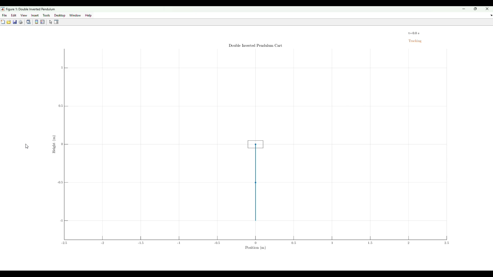
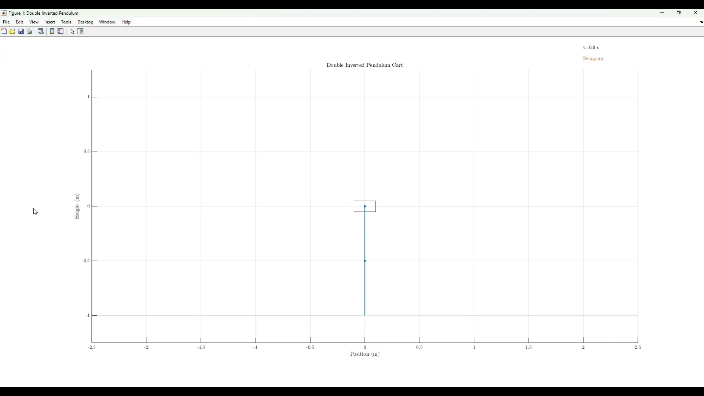
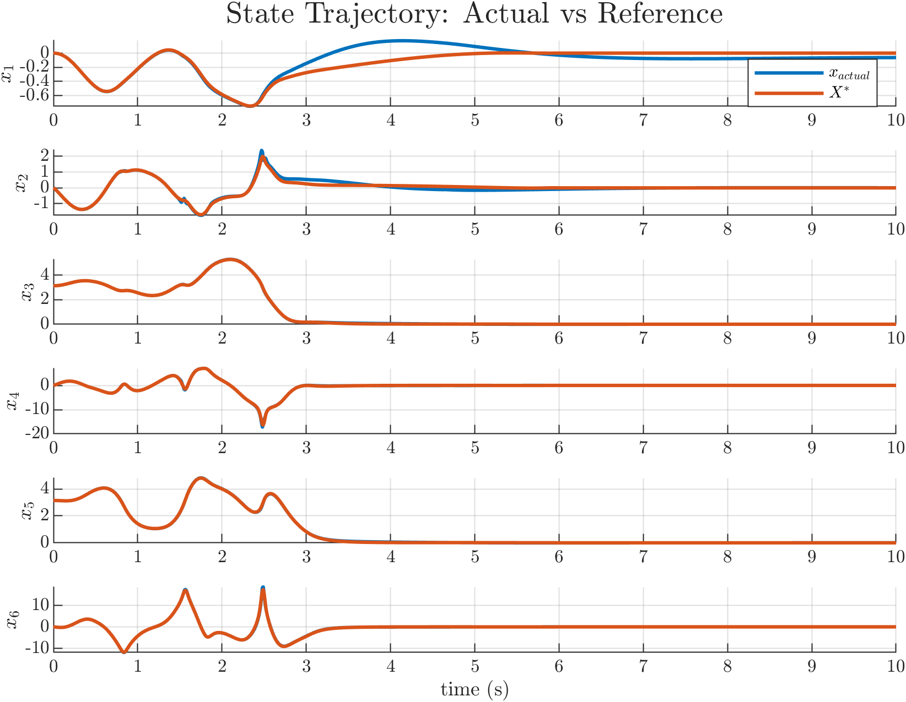
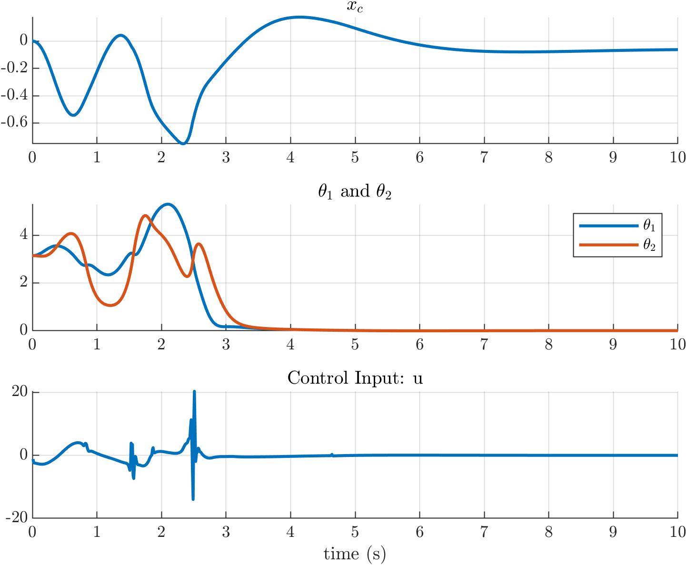

# Double-Inverted-Pendulum-Cart
*Swing-up and stabilization control of double inverted pendulum on a cart*

## Project Overview
In this project, I 

## Key Features
* **temp:** stuff

## Visuals
### 1. Control System Comparison

  
  

### 2. Trajectory Optimization: Actual vs Reference, Positions and Input

  
  

## Skills & Software Used
* **Software:** MATLAB, Simulink,
* **Hardware:** 
<!--**Concepts:** -->
